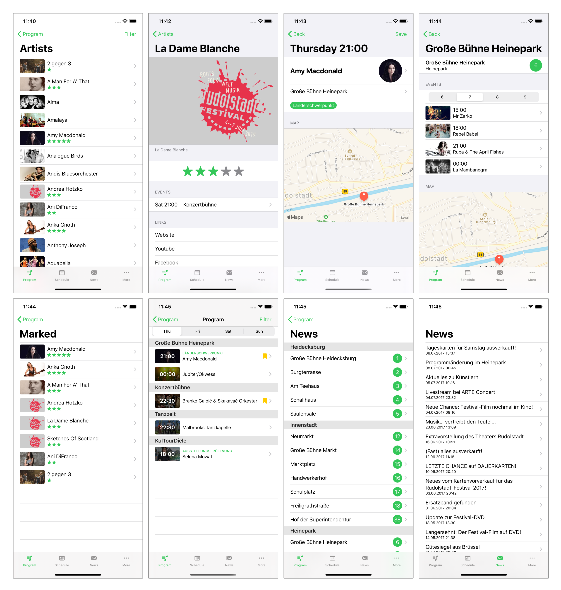

# Rudolstadt for iOS
This is an unofficial client for the so called "Rudolstadt-Festival" written in Swift with SwiftUI.

## Screenshots

Screenshot UI tests run on GitHub Actions for every push via `.github/workflows/ios-screenshot-tests.yml`.
Each workflow run uploads extracted PNG screenshots plus the full `.xcresult` bundle as downloadable artifacts in the run summary.

## Special Features
- Dark mode
- Search in lists
- Stage numbers
- Nearby stages
- In-app map
- Save events in-app
- Warning message for events that overlap with a saved event
- Rate artists
- Calculate the best possible schedule according to artist rating (shown as recommendations)
